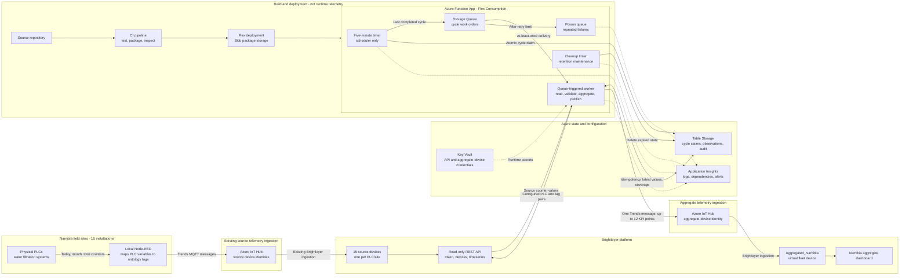

# Namibia Aggregation Architecture v2

## Purpose

Aggregate 12 fleet KPIs across 15 Namibia PLC sites every five minutes and publish them to a separate Brightlayer virtual device named `Aggregated_Namibia`.

The existing field telemetry path remains unchanged. Azure reads telemetry already stored by Brightlayer; it does not connect directly to PLCs.

## Full architecture



## Runtime sequence

1. Each PLC exposes production, solar, grid, and CO2 counters to its local Node-RED flow.
2. Node-RED publishes normal per-device `Trends` telemetry through the existing IoT Hub path.
3. Brightlayer stores and displays every PLC as a separate source device.
4. At each five-minute boundary, the scheduler identifies the last completed UTC interval.
5. The scheduler atomically claims that cycle in Table Storage and enqueues a small work order. It performs no Brightlayer calls or aggregation.
6. The queue worker receives the work order and loads the canonical source/KPI configuration and credentials.
7. The worker reads configured device/tag pairs from the Brightlayer timeseries API in configurable sequential batches.
8. Current observations are stored. Missing pairs may use their latest persisted observation while retaining its original timestamp and explicit carried, stale, or offline state.
9. Coverage is evaluated by distinct PLC, source pair, and KPI. Returned tag-row count is never treated as PLC completeness.
10. The worker calculates the 12 fleet KPI values under the configured strict or permissive policy.
11. A nonempty mapped `Trends` payload is sent through the `Aggregated_Namibia` IoT Hub device identity.
12. Brightlayer displays those points on the aggregate virtual-device dashboard.
13. Successful writeback is recorded so duplicate queue delivery cannot publish the same logical cycle twice.

## Queue work order

The queue carries work identity, not telemetry or credentials.

```json
{
  "schemaVersion": 1,
  "cycleKey": "2026-08-24T10:00:00Z",
  "cycleStartUtc": "2026-08-24T10:00:00+00:00",
  "cycleEndUtc": "2026-08-24T10:05:00+00:00",
  "correlationId": "<uuid>"
}
```

Queue delivery is at least once. Table Storage therefore owns business idempotency and MQTT writeback deduplication.

## KPI semantics

The output contains four KPI families, each with total, today, and month values:

- Production
- Solar energy
- Grid energy
- Avoided CO2

`Today` means the PLC/Brightlayer counter since its local midnight reset. It is not a rolling 24-hour calculation. Azure cycle keys and schedules remain UTC because Flex Consumption does not support `WEBSITE_TIME_ZONE` or `TZ`.

## Failure behavior

- A scheduler restart cannot create a second logical cycle because the cycle claim is idempotent.
- A transient worker failure returns the queue message for retry.
- A message exceeding the configured dequeue count moves to the poison queue.
- Partial source data does not silently become complete.
- Missing values are never replaced with zero.
- An empty or policy-invalid MQTT payload is marked `skipped` or `incomplete`, not `sent`.
- Application Insights records scheduler, worker, Brightlayer dependency, writeback, and poison-queue behavior.

## Deployment boundary

Flex Consumption runs an immutable package from deployment Blob storage. CI must:

1. Run the automated tests.
2. Build one deterministic deployment artifact.
3. Reject duplicate ZIP entries, backslash paths, local settings, virtual environments, caches, and tests.
4. Verify `function_app.py`, `host.json`, and `requirements.txt` at the package root.
5. Deploy the exact artifact that passed inspection.
6. Verify function indexing and smoke telemetry after deployment.

The current Y1/Dynamic Bicep model is obsolete and must not be used to recreate the live Flex Consumption app.
