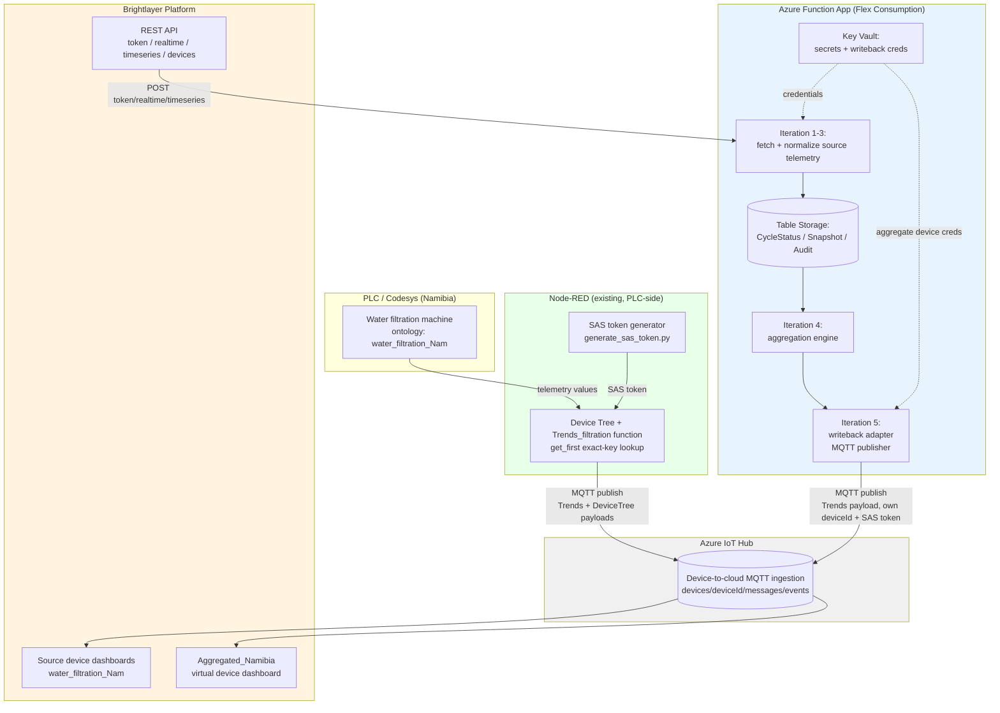

# Namibia Azure Aggregation — Architecture & Confirmed Facts

Reference notes for the Brightlayer/Azure aggregation pipeline. Kept in sync with `/memories/session/plan.md` during active work; this file is the durable, repo-committed version.

## Solution diagram

- **Read direction** (Brightlayer → Azure): REST API only (`token`, `realtime`, `timeseries`, `devices`). Confirmed from official doc "API Documentation example Boreal v26-07-23-01".
- **Write direction** (Azure → Brightlayer): Azure IoT Hub MQTT D2C messages, same mechanism the PLCs already use, targeting the `Aggregated_Namibia` virtual device's own device identity. There is **no REST endpoint for writing telemetry** — the only REST write path (`/command`) is control-channel only and not usable here.

## Confirmed REST API surface (read-only for telemetry)

Prefix example: `https://portal.machinery-monitoring.com`

| Endpoint | Purpose |
|---|---|
| `POST /api/v1/auth/serviceaccount/token` | `{serviceAccountId, secret}` → `{token}` |
| `POST /api/v1/dashboard/devices/{deviceId}/realtime` | `{tagId}` → current value + unit + timestamp |
| `POST /api/v1/dashboard/devices/timeseries` | `{devices:[{deviceId,tagTrait}], startDateTime, endDateTime}` → historical values |
| `GET /api/v1/dashboard/organization/{organizationId}/devices` | list of `{id, name}` devices in org |
| `POST /api/v1/dashboard/devices/{deviceId}/command` | control-channel write only; water_filtration ontology has no control channels defined — not usable for telemetry writeback |

`tagId` values come from the per-device ontology file (e.g. `water_filtration_Nam_aa0af1a1-895c-4b99-8e44-e3fe82cc3385.json`).

## Confirmed MQTT/IoT Hub writeback mechanism

Reverse-engineered from `125_Senegal/generate_sas_token.py` and `125_Senegal/RO_MQTTOut_final` (Node-RED flow).

- Each Brightlayer device = an Azure IoT Hub device identity + symmetric key (matches ontology `provision.method: CONNSTR / SYM_KEY`).
- MQTT connect: `{hostname}.azure-devices.net:8883`, TLS, ClientID = deviceId, Username = `{hostname}/{deviceId}/?api-version=2021-04-12`, Password = SAS token (or handled automatically by the `azure-iot-device` SDK using a device connection string).
- Topic: `devices/{gwId}/messages/events/{urlencoded properties}`
- Two payload types:
  - `DeviceTree` (device/child registration, one-time-ish): `{"d":{"d":"<GUID>","profile":"<ontology GUID>","name":"...","ds":[...]}}`
  - `Trends` (periodic telemetry — what Iteration 5 needs): `{"trends":[{"c":"<tagId>","t":<epoch seconds>,"v":<value>}, ...]}`

### Node-RED `get_first` / `Trends_filtration` note (PLC-side, not Azure)

The existing Node-RED function resolves each channel's value via a `getFirst(candidate1, candidate2, ...)` fallback chain because PLC firmware historically used inconsistent global variable names. With the new `water_filtration_Nam` ontology, global variable names will exactly match the ontology's `keyValue`/`name` fields, so this function can be simplified to single exact-key lookups with tagIds updated to match this ontology. This is a Node-RED-side fix, tracked separately from the Azure Function App iterations.

### Why manual SAS token generation isn't a concern for Azure

`125_Senegal/generate_sas_token.py` exists only because Node-RED's `mqtt out` node can't generate/renew IoT Hub SAS tokens itself. The Azure Function App will use the official `azure-iot-device` Python SDK instead, which handles SAS token generation/renewal automatically from a device connection string — no manual token math, no long-lived static secrets.

## Aggregate virtual device requirements (before Iteration 5 can complete)

- `Aggregated_Namibia` needs its own Brightlayer ontology profile defining KPI channels with their own tagIds (analogous to `water_filtration_Nam`'s per-channel tagIds).
- `brightlayer-writeback-credentials` Key Vault secret should store the aggregate device's IoT Hub connection string (hostname, deviceId, symmetric key).

## Iteration progress (see also `/memories/session/plan.md` for live status)

- Iteration 0 (bootstrap/contracts): done — skeleton, config contracts, Bicep, app settings deployed.
- Iteration 1 (Brightlayer auth + read client): implemented in `src/shared/brightlayer_client.py` — real `token`, `realtime`, `timeseries`, `devices` calls against the REST API above, with retry via `src/shared/retry_policy.py`.
- Iterations 2-10: not started (cycle planner/state, telemetry normalization, aggregation engine, MQTT writeback adapter, orchestration, retry/failure handling, cleanup/retention, observability, production readiness).

## Known infra gaps (from Function App setup work)

- `applications/namibia-aggregation/azure_aggregation/infra/main.bicep` models a classic Y1/Dynamic Consumption plan, but the live Function App is Flex Consumption (FC1) — Bicep is not currently the source of truth for the deployed resource. Reconciling this is a pending decision.
- Bicep enables Key Vault RBAC auth but does not assign the Function App's managed identity the "Key Vault Secrets User" role — needs verification/fix.
